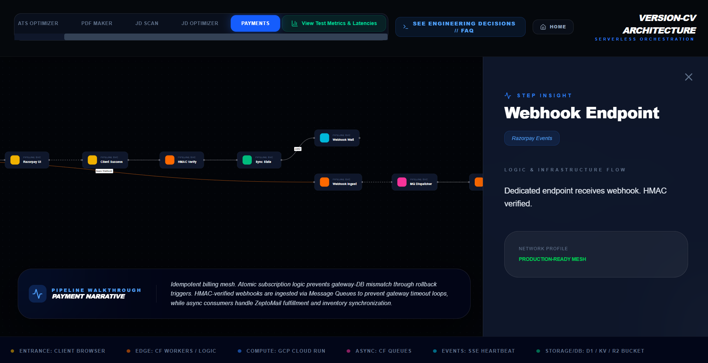
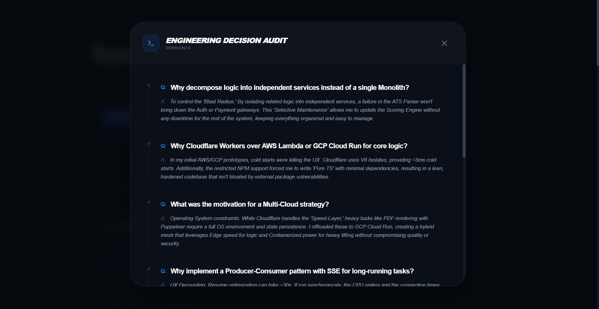

  # Ayush Pandey // Architecture-First Portfolio
  **An Industrial-Grade Showcase for the "New Year, New You" Google AI Portfolio Challenge**
  
  
  
  
  
  > **Production URL:** [https://ayushpandey.me](https://ayushpandey.me)  
  > **Infrastructure Status:** Shielded via Cloudflare Edge (DDoS Mitigation)
  
  ---
  
  ##  Engineering Vision: Beyond the Surface
  Most portfolios function as static galleries. This platform is an **Engineering Audit**. 
  
  I have architected this portfolio to expose the **"How"** and the **"Why"** behind my development ecosystem. Instead of a surface-level list, I provide a deep-dive into my flagship SaaS, **VersionCV**. Using **Gemini 3 Flash** to generate structured **React Flow** pipeline, I created a dynamic map of distributed service dependencies, allowing evaluators to audit the system design of my project in an interactive way.

  
*Figure 1: Interactive System Design view of projects generated via Gemini 3 Flash and React Flow.*
  
  ---
  
  ##  Portfolio Infrastructure & Security
  The portfolio itself is optimized for high-performance delivery while maintaining professional-grade security:
  
  * **Shielded Origin Architecture:** The portfolio's **Google Cloud Run** instance is protected by a **Cloudflare Proxy**. This setup masks the origin IP, mitigates DDoS risks , and prevents "Denial of Wallet" attacks by filtering malicious traffic before it impacts the compute budget.
  * **Design Decision FAQs:** I have integrated a technical FAQ for project to explain the intuition behind my architectural choices.

*Figure 2: Project-specific FAQ detailing the engineering "Why" behind all architectural decisions and trade-offs.*
  ---
  
  ##  Google AI Integration: The Co-Architect
  
  ### 1. Gemini as the Intelligence Engine (Showcased Project: versionCV)
  **VersionCV** leverages **Gemini 3 Flash** for its core resume-to-job-description optimization engine.
  * **Hallucination Control:** I implemented a strict **XML Tagging** schema for prompts. This algorithmic approach enforces structured data outputs and ensures high-fidelity entity extraction.
  * **Performance Benchmarking:** R&D indicated that while various LLMs offer quality outputs, Gemini 3 Flash provided the **lowest latency** and highest **cost-economy** for high-token NLP tasks.
  
  ### 2. Gemini as the UI Architect (Portfolio Feature)
  I utilized Gemini to bridge the gap between abstract architecture and visual implementation within this portfolio. It assisted in generating the node/edge logic for the interactive **React Flow** pipelines that map out the internal services of the projects I build.
  
  ---
  
  ##  The Cloud Run Optimization: 
  This portfolio chronicles a real-world performance refactor on **Google Cloud Run**:
  
  1.  **The Bottleneck:** Initial monolithic deployments suffered from a **~5 second cold-start latency** when the service went idle.
  2.  **The AI-Powered Audit:** Using Gemini to analyze Docker layer efficiency, I identified that unoptimized dependency overhead was bloating the image size.
  3.  **The Solution (3-Stage CI/CD):** I refactored the deployment into a **Multi-Stage Docker Build**:
      * **Stage 1 (Deps):** Strict isolation of `package.json` to maximize layer caching.
      * **Stage 2 (Builder):** High-performance compilation environment.
      * **Stage 3 (Runner):** A minimalist **node:20-slim** production image.
  4.  **The Outcome:** Drastic reduction in image pull times and optimized **Scale-to-Zero** configuration, resulting in significantly decreased cold-start times and zero idle costs.
  
  ---
  ## Industrial Tech Stack
  * **AI/ML:** Google AI Studio (Gemini 3 Flash), Gemini CLI
  * **Infrastructure:** Google Cloud Run (Primary Compute), Cloudflare (WAF/DNS)
  * **Frontend:** Next.js (App Router), Tailwind CSS, Framer Motion, React Flow
  * **Runtimes:** Node.js
  ---

